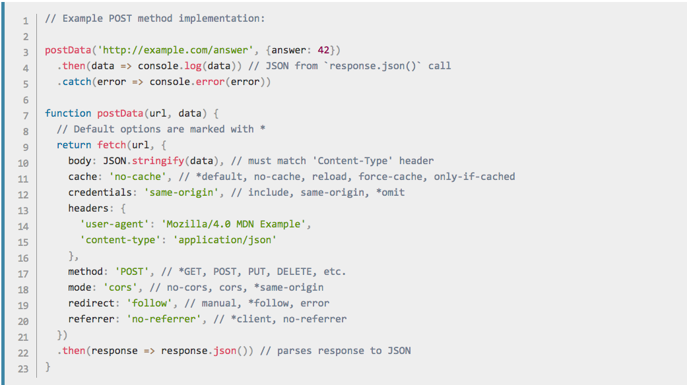

# Fundamental JS

The Fetch API

---
## What am I fetching?

Data from other servers or API services. This is a Promise-based API built into the browser to get information asynchronously.

---
## Quick Example

```
fetch('http://example.com/movies.json')
  .then(function(response) {
    return response.json();
  })
  .then(function(myJson) {
    console.log(myJson);
  });
```
---
## Sending options

If you return a `fetch` function in a function, you can still call it as a Promise

---
## Example



---
## Check for Success
```
fetch('flowers.jpg').then(function(response) {
  if(response.ok) {
    return response.blob();
  }
  throw new Error('Network response was not ok.');
}).then(function(myBlob) { 
  var objectURL = URL.createObjectURL(myBlob); 
  myImage.src = objectURL; 
}).catch(function(error) {
  console.log(error.message);
});
```

---
## Sending Data

Yeah, you can do that too.

---
## Wait, what?

It's kind of a misnomer since you can send data. This is a new API designed to replace all XML HTTP Requests. 

You can use the full range of HTTP verbs such as GET, POST, PUT, DELETE, etc.